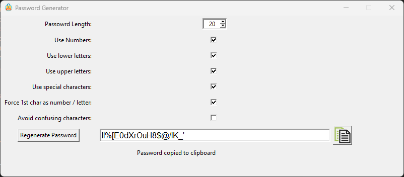

# Password Generator GUI (Python w/TKinter)

This utility will allow you to generate a password based on the symbol sets you specify and desired length.

The password is copied to the clipboard for easy pasting.

| **Property**                      | **Details**                                                       |
|-----------------------------------|-------------------------------------------------------------------|
| Password Length                   | From 1 to 100                                                     |
| Use Numbers                       | Generated password may include [0-9]                              |
| Use lower letters                 | Generated password may include [a-z]                              |
| User upper letters                | Generated password may include [A-Z]                              |
| Use special characters            | Generated password may include [`~!@#$%^&*()_-+={}[]\|:;"'<>,.?/] |
| Force 1st char as number / letter | The first character of the password cannot be a symbol            |
| Avoid confusing characters        | The password will not include the following [lIO01]               |

The Generate Password button is used to produce a new password.

Generated passwords are automatically copied to the clipboard making the copy icon redundant.
